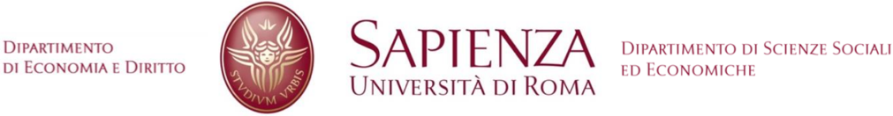

DIPARTIMENTO

DI ECONOMIA E DIRITTO

SAPIENZA

DIPARTIMENTO DI SCIENZE SOCIALI

## Workshop on Household Heterogeneity, Inflation, and the Green Transition

Sapienza University of Rome, June 6 th  and 7 th  2024

Venues: Facoltà di Economia, via del Castro Laurenziano 9,  and Facoltà di Scienze Politiche, Sociologia, Comunicazione, piazzale Aldo Moro 5, Rome.

June 6 th : Sala Lauree, Facoltà di Economia, via del Castro Laurenziano 9

14:00 Registration and welcome address

Session 1: The heterogenous effect of Inflation

Chair: Cristiano Cantore (Sapienza University of Rome)

14:30-15:15 "The Heterogeneous Impact of Inflation on Households' Balance Sheets" Clodomiro Ferreira (Banco de España) (joint with Miguel Cardoso,  José Miguel Leiva, Galo Nuño, Álvaro Ortiz, Tomasa Rodrigo, and Sirenia Vazquez)

Discussant: Francesco Corsello (Banca d'Italia)

15:15-16:00 ' Shopping  behavior  and  the  effect  of  monetary  policy  on  inflation  heterogeneity  along  the income distribution ' Miguel Ampudia (BIS), Michael Ehrmann (ECB) and Georg Strasser (ECB)

Discussant:

Luigi Paciello (EIEF)

16:00-16:30 Coffee Break

16:30-17:15 'Inflation is not equal for all: the heterogenous effects of energy shocks' Marianna Riggi (Banca d'Italia) (joint with F. Corsello)

Discussant:

Patrizio Tirelli (Università di Pavia)

20:00 Dinner at 'La Casa dell'Aviatore' (invitation only)

June 7 th : Sala Lauree, Facoltà di Scienze Politiche, Sociologia, Comunicazione, piazzale Aldo Moro 5

Session 2: The heterogenous effect of the green transition

Chair: Salvatore Nisticò (Sapienza University of Rome)

9:00-9:45 "Climate Policies, Macroprudential Regulation, and the Welfare Cost of Business Cycles" Barbara Annicchiarico (Roma Tre University) Marco Carli (Tor Vergata University) Francesca Diluiso (Bank of England)

Discussant: Fabio Di Dio (Sapienza University)

9:45-10:30 'Macro Shocks and Inequality' Francesco Furlanetto (Norges Bank) (joint with Drago Bergholt and Lorenzo Mori)

Discussant: Elisa Guglielminetti (Banca d'Italia)

10:30-11:00 Coffee break

11:00-11:45 'Distributional  Effects  of  the  Green  Transition' Andrea  Colciago  (Dutch  Central  Bank  and University of Bicocca) (joint with Guido Ascari, Timo Haber, Stefan Wöhrmüller)

Discussant: Andrey Alexandrov (Università di Roma Tor Vergata)

12:00-13:30 Policy Panel: Andrea Brandolini (Bank of Italy), Corrado Pollastri (Parliamentary Budget Office), Ottavio Ricchi (Director of the Economic and Financial Analysis and Research of the Treasury)

13:30-15:00 Buffet Lunch